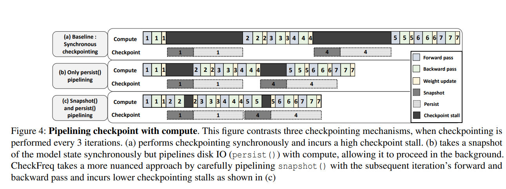
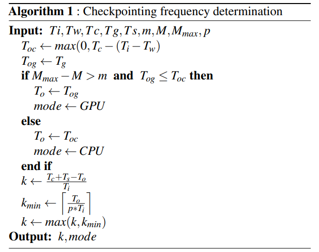
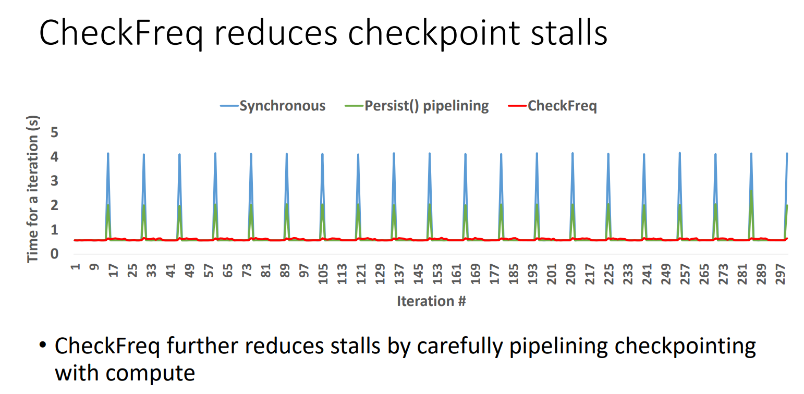
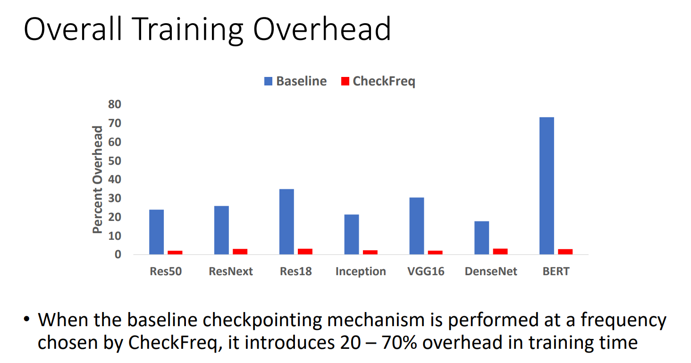

## Background and Motivation

Training a DNN is a highly time-consuming process, especially for large models and datasets. The learnt model state can be easily lost due to a process crash, server failure, or VM preemption. Meanwhile, existing checkpointing techniques are performed in an ad-hoc manner, with the following limitations:

* Checkpointing is Incorrect: checkpointing overwrites the same checkpoint file and do not `fsync` the file, leading to data loss.
* Checkpointing is Inefficient: checkpointing is performed by the end of an epoch and the checkpointing frequency is scheduled naively, leading to a high overhead.
* Incomplete Checkpointing: the state of the dataloader is not included in the checkpoint, violating data invariant.

To address these limitations, the authors proposed a novel checkpointing technique called CheckFreq, which offers a low-cost checkpointing mechanism, a resumable dataloader, and a fine-grained systematic method to determine the checkpointing frequency at runtime.

## Design and Implementation

CheckFreq first implemented a two-phase asynchronous checkpointing mechanism, which includes:

1. **Phase 1: snapshot**: the model state is copied in the device or to the host memory if the device memory is not sufficient enough. This phase is performed asynchronously to the forward and backward pass.
2. **Phase 2: persist**: the model state is written to the disk. This phase is performed asynchronously to the forward and backward pass.

CheckFreq guarantees that only one checkpointing operation is performed in the background. As for the dataloader state, CheckFreq implemented a resumable dataloader by storing the seed of the dataloader and corresponding indices.

To determine the checkpointing frequency, CheckFreq first profiles several metrics of the training process, including  the iteration time (\(T_i\)), time to perform weight update (\(T_w\)), time to create an in-memory GPU copy (\(T_g\)), time to create an in-memory CPU copy (\(T_c\)), time to write to storage (\(T_s\)), size of checkpoint (\(m\)), peak GPU memory utilization (\(M\)), and total GPU memory (\(M_{max}\)).

The checkpointing frequency is then determined by the following algorithm. It also determines the mode (CPU or GPU-based) of the snapshot phase.

## Evaluation

## Links and References

* [Paper PDF](https://www.usenix.org/system/files/fast21-mohan.pdf)
* [Paper Slides](https://www.usenix.org/sites/default/files/conference/protected-files/fast21_slides_mohan.pdf)
* [Paper Code](https://github.com/msr-fiddle/CheckFreq)
