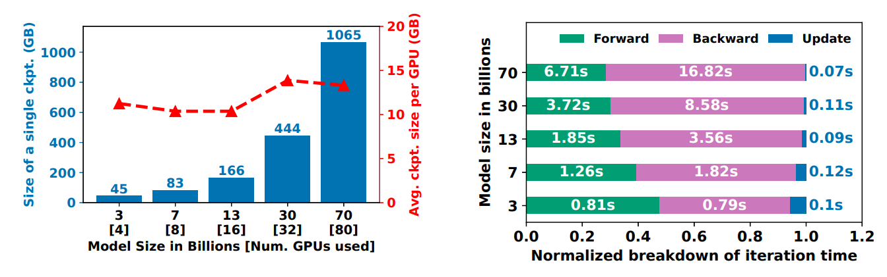
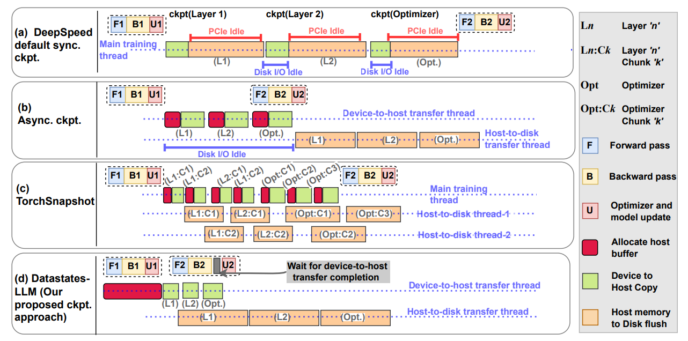
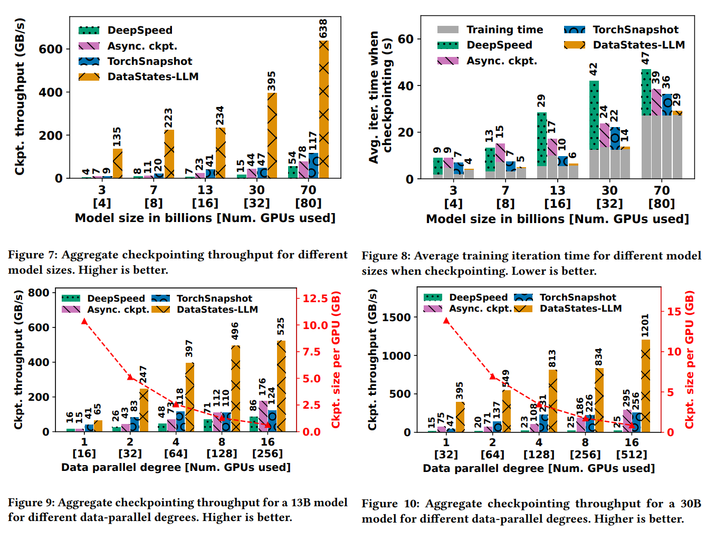

## Background and Motivation

Today's large language models (LLMs) are trained on massive datasets and require large models to achieve state-of-the-art performance. Training these models is computationally expensive and requires distributed training across multiple GPUs. 3D parallelism is a common technique to scale training to large models and datasets, it includes:

* **Data Parallelism**: it creates replicas of the model on multiple workers and partitions the data across them. Gradients are aggregated across workers in the backward pass.
* **ZeRO Data Parallelism (ZeRO-DP)**: similar to data parallelism, but it maintains a single replica across workers and the full layer parameters are given on demand.
* **Pipeline Parallelism**: it divides the model into stages and processes different parts of the input in parallel.
* **Tensor parallelism**: it partitions tensors across multiple workers. They are processed in parallel and only aggregated when necessary.

The training process is prone to failures due to the tightly coupled nature of the distributed training process. Checkpointing is a common technique to recover from failures by saving the model state periodically. State of the art suffers from the following limitations:

* Synchronous checkpointing blocks the training process and incurs a high runtime overhead.
* Existing asynchronous checkpointing techniques either does not support hybrid 3D parallelism or fails to saturate the network links.

In this paper, the authors proposed a two-level checkpointing mechanism called DataStates-LLM, providing better support for 3D parallelism and reducing the checkpointing overhead, based on two observations:

* LLM checkpoint size grows quadratically due to the explosion of the optimizer state size.
* The forward and backward passes take up the majority of the training time in each iteration.

## Design and Implementation

### Design Principles

* **Coalescing of GPU Model/Optimizer Shards to Host Memory**: the proposed design coalesces the copies of the shards to host memory with pre-allocated pinned buffers, eliminating the need to wait for the flushes of the shards belonging to the same checkpoint.
* **Lazy Non-Blocking Copies Overlapping with Forward and Backward Pass**: the proposed design overlaps the copies of the shards with the forward and backward passes, leveraging the observation of immutability.
* **Streamlined Multi-level Flushing to Persistent Storage**: the proposed design pipelines the device-to-host copies and the host-to-storage writes, reducing the I/O overhead in checkpointing.
* **Asynchronous Distributed Consolidation of Model and Optimizer Shards**: the proposed design supports asynchronous consensus protocols in every level of the checkpointing process.

### Implementation Details

The proposed design is implemented as a modular extension to the DeepSpeed runtime and is therefore transparent to the user. It is implemented in C++ with dedicated CUDA streams and threads managing device-to-host and host-to-storage transfers. Background checkpointing and flushing are implemented purely in C++ with no Python overhead.

## Evaluation

## Links and References

* [Paper PDF](https://doi.org/10.1145/3625549.3658685)
* [Paper Code](https://github.com/DataStates/datastates-llm)
* [Efficient Training on Multiple GPUs](https://huggingface.co/docs/transformers/main/en/perf_train_gpu_many)
