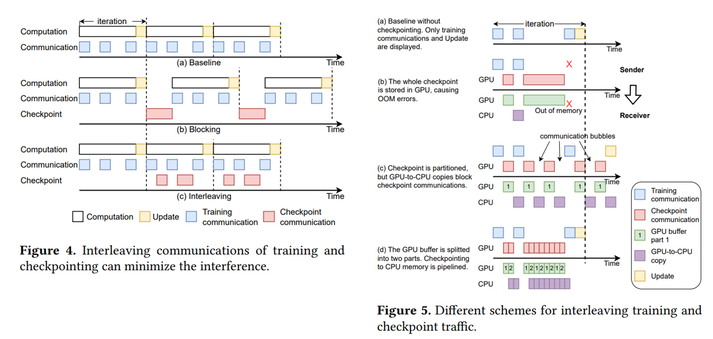
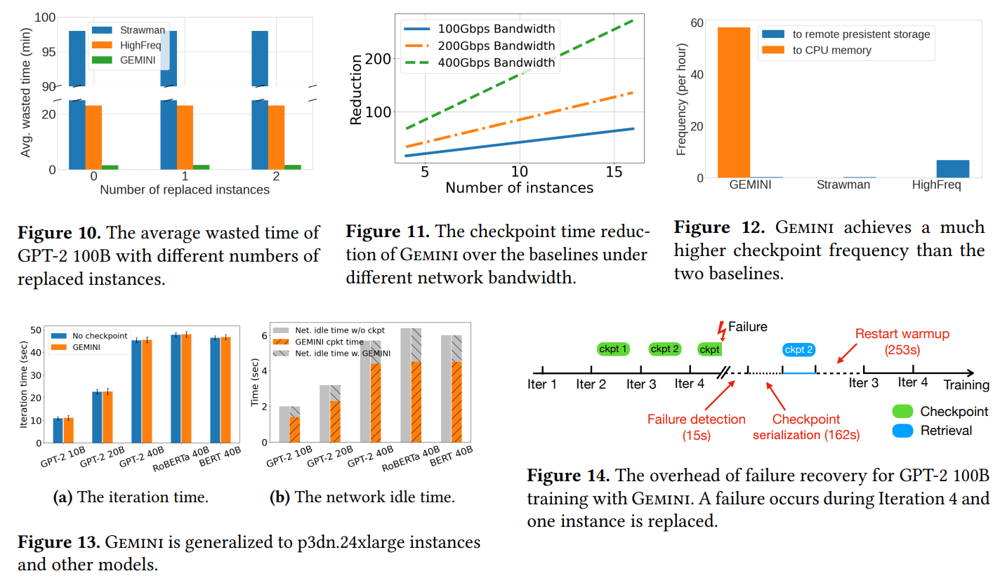
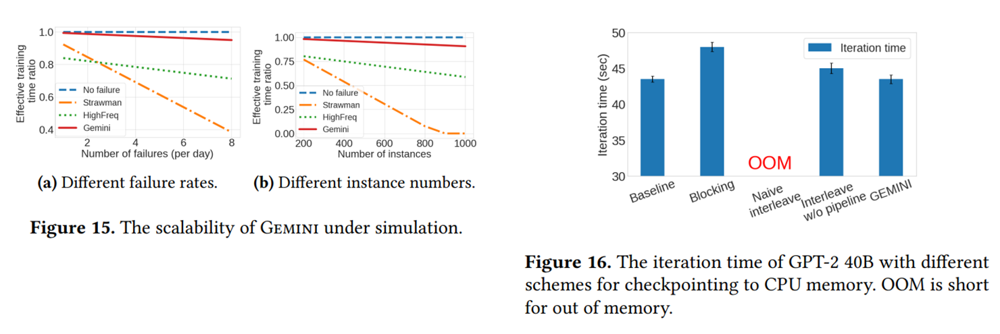

> Remark: this paper is well-written and gives a promising idea about using a fine-grained distributed in-memory cache to store the latest checkpoint, reducing the failure recovery time. This idea is novel and can potentially fused with existing asynchronous multi-level checkpointing techniques to further reduce the checkpointing and recovery time.

## Background and Motivation

A significant amount of computational resources are wasted in the failure recovery process of distributed training. Existing checkpointing techniques fail to achieve high checkpoint frequency and fast recovery time due to the bandwidth bottleneck of the remote persistent storage.

Since the CPU memory is much larger than the GPU memory and hence can store more checkpoints, it is possible to store the latest checkpoint in the CPU memory and the rest in the remote persistent storage. While this idea seems promising, it comes with the following challenges:

* How to maximize the probability of failure recovery from checkpoints stored in CPU memory?
* How to minimize the interference of checkpoint traffic with model training?

In this paper, the authors present Gemini, a system that utilizes the CPU memory to store the latest checkpoint, along with a near-optimal checkpoint placement algorithm and a fine-grained traffic scheduling algorithm to reduce the failure recovery time.

## Design and Implementation

The architecture of Gemini consists of two components: the checkpoint creation module and failure recovery module.

The checkpoint creation module first solves the problem of how to maximize the probability of failure recovery from checkpoints stored in CPU memory by a checkpoint placement algorithm. The algorithm partitions the \(N\) nodes into \(\lfloor N/m \rfloor\) groups, where \(m\) is the number of replicas. For groups that are divisible by \(m\), the group placement strategy is used to place the checkpoints in the CPU memory. For groups that are not divisible by \(m\), the ring placement strategy instead.

In addition, the checkpoint creation module solves the problem of how to minimize the interference of checkpoint traffic with model training by a fine-grained traffic scheduling algorithm. Before the forward pass, backward pass and update pass, one node will exchange data with other nodes to collect the latest parameters and gradients. Gemini captures this pattern by online profiling and schedules the checkpoint traffic accordingly to interleave with the data exchange traffic.

Meanwhile, Gemini partitions checkpoints into chunks to reduce the GPU memory consumption in GPU to remote CPU copy. It further divides the chunks into sub-chunks to pipeline the GPU to remote GPU copy and remote GPU to remote CPU copy.

The failure recovery module manages the failure recovery process for both software and hardware failures. For software failures, the failure recovery module will restart the training process from the latest checkpoint stored in the CPU memory. For hardware failures, the failure recovery module will assign a standby node and restore the latest checkpoint from the corresponding group. If the group is malfunctioned as well, the checkpoint will be restored from the remote persistent storage instead. Failure detection node-wise is implemented by cloud operators and the standby node is reserved in advance.

## Evaluation

## Links and References

* [Paper PDF](https://doi.org/10.1145/3600006.3613145)
