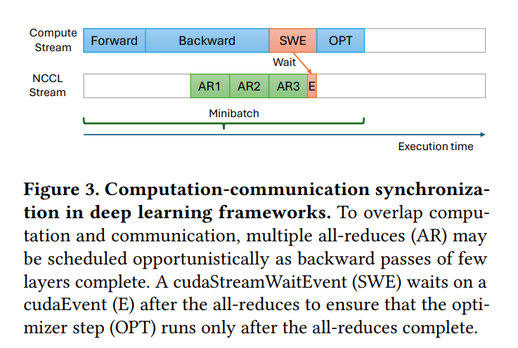
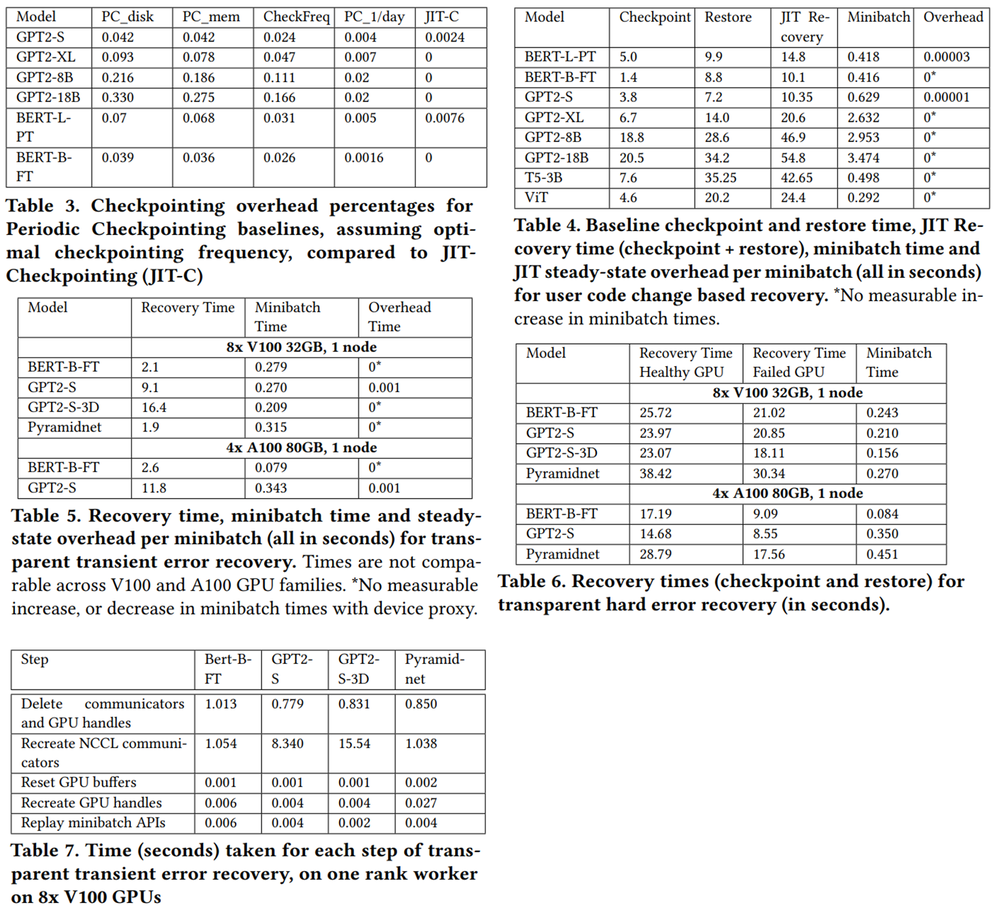

> Remark: this paper depicts a refreshing idea of checkpointing only when failures occur and executes it well by implementing both user-level and transparent approaches. The overhead analysis and evaluation are well done, and the results are promising. It is a good read for those interested in checkpointing in distributed training and the idea it presents is worth further exploration.

## Background and Motivation

Periodic checkpointing in the distributed training of deep learning models can be expensive especially when the model size is large. A large amount of GPU work is also wasted when recovering to the latest checkpoint. This paper proposes a just-in-time checkpointing mechanism that takes a radically different approach to checkpointing. Instead of periodically checkpointing the model, the proposed mechanism checkpoints the model only when a failure is detected. This approach is motivated by the following observations:

* Most errors during training occur due to failures of a single GPU or network device, while host/CPU and simultaneous multi-node failures are extremely rare.
* Model parameters and optimizer states are only updated during the small time interval of optimizer step.
* Large model training almost always employs data parallelism, where model parameters and optimizer states are replicated across all GPUs.

Leveraging these facts, the proposed solution is able to recover from common failures in few seconds by re-doing at-most a minibatch of work. In cases of FSDP and ZeRO, hybrid sharding is required to provide replicas for failure recovery.

## Design and Implementation

The proposed solution includes an user-level and a transparent approach. The user-level approach allows the user to define the behavior of checkpointing  and incorporates with existing periodic checkpointing mechanisms. The transparent approach enables system-level just-in-time checkpointing without any knowledge of the user.

### User-Level Approach

The first challenge in implementing the proposed solution is detecting failures. Leveraging the fact that collective communication operations hang if one rank fails, the proposed solution uses a watchdog thread that monitors the `cudaEvents` on NCCL streams and triggers a timeout if the all-reduce operation hangs. Then the checkpointing process is initiated to save the GPU state. The aforementioned mechanism is implemented as an interception of CUDA and NCCL calls using LD_PRELOAD.

The second challenge is to correctly checkpointing the GPU state. In the user-level approach, an user-defined callback is called to save the GPU state. In practice, calling the user-defined Python function from a hanging context poses two problems:

* Calling Python functions involves acquiring the Global Interpreter Lock (GIL), which may be held by another hanging thread. This is solved by implementing a signal handler which releases the GIL to the watchdog thread. Since the hanging thread is killed after checkpointing, race conditions cannot happen.
* `cudaMemcpy` issued by the Python function uses the default stream, which may be blocked by the hanging NCCL stream. This is solved by intercepting the `cudaMemcpy` calls and issuing them on a separate stream.

In the recovery phase, the user-level approach waits healthy ranks for checkpointing then restores the model parameters and optimizer states from the corresponding checkpoint path.

A point to note is that if a failure occurs during the forward pass, backward pass, or the all-reduce operation of iteration \(i\), the all-reduce operation of \(i\) will hang, resulting the checkpointing of iteration \(i\). If the failure occurs during the optimizer step of iteration \(i\), the checkpointing of iteration \(i+1\) will be triggered. The checkpoint is in a consistent state in both cases.

### Transparent Approach

In addition to the error-detection in the user-level approach, the transparent approach records all device API calls into a replay log which will be used in recovery. To avoid implicit device calls, a validation minibatch is used at the 5th iteration and then every \(N\) iterations, where the GPU state will be compared to that from replaying the replay log, to verify the correctness of the replay log.

When recovering for errors during forward or backward pass,

* If the GPU is still accessible and no driver corruption is detected, which is the case for network issues or errors in another rank, then the model parameters and optimizer states will remain the same, while other buffers will be freed.
* If the GPU is accessible but driver corruption is suspected, the model parameters and optimizer states will be copied to the host and then restored after the driver is reset.
* If the GPU is not accessible, but there is no hardware failure, the GPU will be reset and the model parameters and optimizer states will be restored from another rank with data parallel replica.

Once all ranks are restored to the start of the iteration, the replay log will be used to recover the GPU objects to the state before the failure. The change of GPU object handles is solved by using virtual handles in the interception layer.

When recovering for errors during optimizer step, since the remaining healthy ranks are sufficient to produce the correct model parameters and optimizer states as of the start of the next iteration, the replay log is not needed. The erroneous rank will ignore the optimizer step and recover to the state of the start of the next iteration. The start and end of the optimizer step are informed to the interception layer by adding pre- and post- hooks to the optimizer step function of the deep learning framework.

When recovering for errors for hardware GPU errors, all other ranks will hang at the next all-reduce operation and perform just-in-time checkpointing to the start of the next iteration. As for the erroneous rank, it will be migrated using the CRIU tool and the GPU state will be restored from the corresponding data parallel replica.

## Evaluation

### Failure Overhead Analysis

Defining the following parameters in the training process:

1. \(o\): This is the overhead time for performing one checkpoint on one GPU. This will depend on the size of the DNN model, bandwidth, checkpointing mechanisms, etc. which will determine the time taken to copy the GPU state.
2. \(f\): This is the failure frequency of one GPU. This will depend on the cluster provider, hardware used, etc.
3. \(r\): This is the fixed cost recovery time from a failure per GPU. It includes costs due to downloading the checkpoint file to all GPUs, process and GPU initialization, training data preparation, etc. This fixed cost is independent of the amount of work redone since the last checkpoint.
4. \(N\): The total number of GPUs used for training.

Then for training time \(t\) with periodic checkpointing frequency \(c\),

* Total failure rate of the job = \(N \times f\).
* Expected number of failures in this duration = \(Nft\).
* Total number of checkpoints in this duration = \(ct\).
* Total periodic checkpointing overhead = \(Ncto\).
* Fixed cost recovery time \(r\) per failure across all GPUs = \(Nft \times r \times N\) = \(N^2ftr\).
* The wasted work which is redone upon restore from the last checkpoint across all GPUs = \(Nft \times \frac{1}{2c} \times N\) = \(\frac{N^2f}{2c}\) (this is on average half the checkpoint interval \(\frac{1}{c}\), in which a few hundreds or thousands of minibatches of data are processed again)
* Total GPU time spent in failure recovery (fixed + re-done work) = \(N^2ft(r + \frac{1}{2c})\).

Thus the total GPU time wasted in checkpointing and failure recovery is:

$$
W = Ncto + N^2ft(r + \frac{1}{2c}) = Nt(co + Nfr + \frac{Nf}{2c})
$$

While the optimal checkpointing frequency is:

$$
c^* = \sqrt{\frac{Nf}{2o}}
$$

In just-in-time checkpointing, the wasted GPU work is limited to half that minibatch time \(m\), then for the user-level approach the total wasted GPU work is:

$$
W_{jit} = Nt(fo + o_{jit} + Nfr + \frac{Nfm}{2})
$$

While for the transparent approach, the total wasted GPU work is:

$$
W_{jit} = Nt(o_{jit} + \frac{Nfm}{2})
$$

### Experiments

## Links and References

* [Paper PDF](https://doi.org/10.1145/3627703.3650085)
