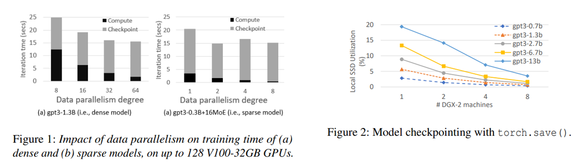
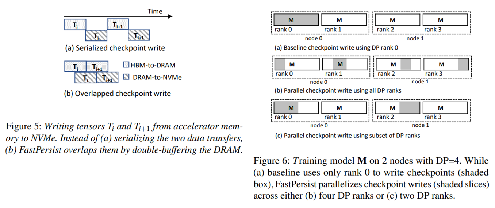
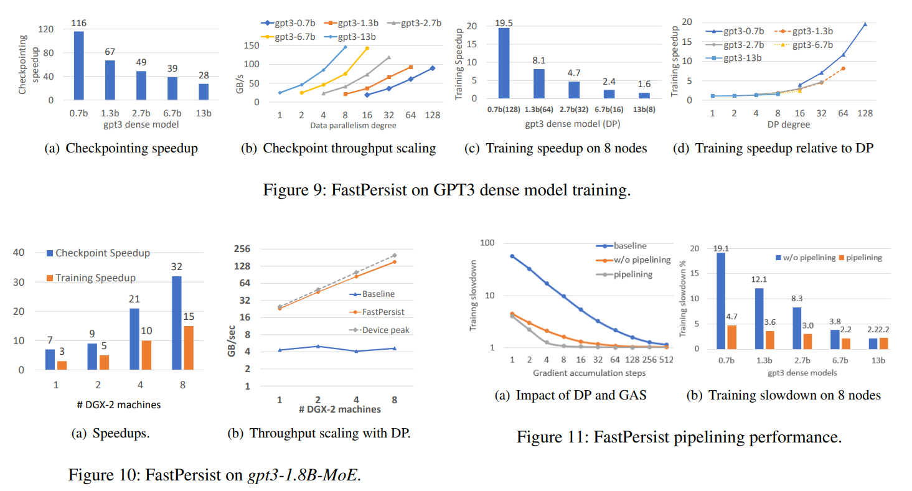

## Background and Motivation

Writing checkpoints to persistent storage, from the perspective of I/O, is mostly ignored by compute-focused optimization efforts of deep learning training. Using data parallelism (DP), the time spent on computation decreases exponentially with the number of GPUs. In contrast, checkpointing time increasingly dominates the overall time.

Previous efforts have been made to exploit the bandwidth capacities of SSDs for various workloads. However, existing checkpointing solutions utilize the SSD bandwidth poorly in both individual and parallel writes. Meanwhile, asynchronous checkpointing schemes risk data loss due to the use of volatile memory. Combining the two makes existing solutions unsuitable for frequent checkpointing, which leads to high recovery costs in case of failure.

In this paper, the authors address the above aforementioned problems proposing FastPersist, which is optimized for NVMe SSDs and provides efficient algorithms for parallel checkpoint writes into SSDs.

## Design and Implementation

FastPersist combines three optimizations to improve checkpointing of deep learning training in NVMe devices:

* **Acceleration of Checkpoint Writes**:
  * FastPersist relies on newer I/O libraries (e.g., `libaio` and `io_uring`) that are designed with asynchronous and parallelism optimizations for extracting maximum NVMe performance.
  * It also employs double buffering of locked pages to pipeline DMA transfers and a hybrid partitioning scheme to deal with data alignment issues.
* **Parallelizing Checkpoint Writes**:
  * It divides the checkpoint among ranks so that each rank only writes a portion of the checkpoint.
  * Partitioning is done in a way that the chunk size is optimal for the NVMe device and the corresponding ranks utilizes all available devices.
  * Scheme for partitioning is determined before training starts and ensures the balance among ranks.
* **Pipelining Checkpoint Writes**: FastPersist pipelines the checkpoint writes to the SSDs by overlapping the computation and I/O operations.

FastPersist is implemented in both PyTorch and DeepSpeed. CUDA multiprocessing is used to implement the pipelining of checkpoint writes.

## Evaluation

## Links and References

* [Paper PDF](https://doi.org/10.48550/arXiv.2406.13768)
