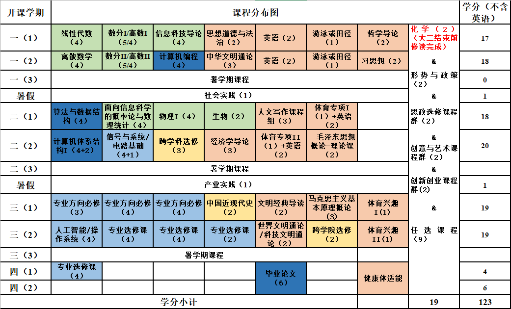
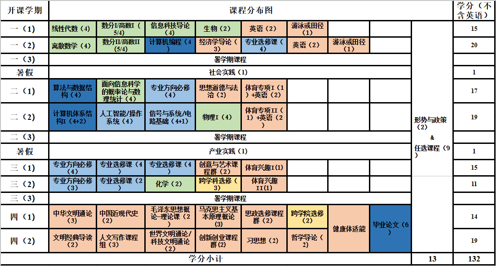

## Introduction

A wise man once told me, "Attending classes not only undermines your grades but also hinders your further development." This is an oversimplified statement, but it does reflect the mindsets behind previous successful stories. There is no denying that every course has its value and can benefit students' lifelong development. However, faced with the harsh requirements of reality, long-term benefits must make way for short-term gains. From this perspective, the statement is not entirely wrong.

This post is intended for the freshmen of Computer Science at ShanghaiTech University in 2024. In this post, I will discuss the reasons behind this statement and the drawbacks of the recommended study plan in the context of these reasons. I will also propose an alternative strategy and map out the journey ahead of you. I hope this post can help you make the most of your time at ShanghaiTech University and prepare you for the next stage of your life.

## Requirements of Reality

It is never inappropriate to say that undergraduate programs end in three years instead of four. The reason is simple: all the applications for your future career take place by the end of the third year. Typically, undergraduate students at ShanghaiTech have three options after graduation: graduate admission, study abroad, and employment. Each of these options shares a similar timeline.

Graduate admission usually starts by the end of the third year. Between May and June, students apply for summer camps hosted by various universities. From June to July, they attend these camps, aiming to secure offers. In August and September, students apply for admission headcounts. Finally, from September to October, the universities make their final admission decisions.

The application process for study abroad usually starts by the end of the third year. In the summer, students survey the universities they are interested in and prepare for the standardized tests. In the fall, students gather recommendation letters, write personal statements, and submit their applications to their target universities. In the winter and early spring, students receive offers and make their final decisions.

The campus recruitment for employment usually starts in the spring of the third year. During this period, students focus on preparing their resumes and attending interviews for summer internships. In the summer, students intern at companies and receive return offers. If they fail to secure return offers, they will start to apply for full-time positions in the fall of the fourth year.

Regardless of the path you choose, the requirements are very similar. First, you need to have a reasonable grade. I use the word "reasonable" because the grade requirement is more like a threshold than a competitive advantage. As long as your grade is above a certain level, it will not be a deciding factor in the application process. Second, you need to have a good background in your field. This can be reflected by your projects, research experience, and internships. None of these can be achieved by attending classes alone. Third, you need to participate in various out-of-class activities. It is a bonus if you have competition awards and other honors.

Either way, attending classes is suboptimal. The knowledge you learn in class can provide a foundation for your future development. However, previous experiences have shown that many classes in ShanghaiTech University, especially those of general education, are not helpful in your field of study while potentially contributing negatively to your GPA. Additionally, the time you spend in class can be used to participate in research projects, internships, and other out-of-class activities. These activities are more valuable in the application process than your GPA.

In summary, it is true that attending classes not only undermines your grades but also hinders your further development, under the requirements of reality. To make the most of your time at ShanghaiTech University, you need to rethink the recommended study plan and adopt an alternative strategy that aligns with these requirements.

## Curriculum and Study Plan

Now let's take a look at the curriculum and recommended study plan for freshmen at ShanghaiTech University in 2024.

Compared to the previous curriculum, the curriculum of 2024 reduces the required credits for chemistry and biology. However, students are required to take more courses in liberal arts and social sciences, such as Introduction to Philosophy and Introduction to Xi Jinping Thought on Socialism with Chinese Characteristics for a New Era. Furthermore, Physical Education is now extended to the third year.

I will not discuss whether these changes are good or bad or whether these liberal arts and social science courses are useful or not. However, there is no denying that none of these courses can help you find a better job or get into a better graduate school. No one will hire you as a software engineer because you did well in Introduction to Marxism.

With this in mind, it is clear that the recommended study plan is incompatible with the requirements of reality for the following reasons:

1. It pays too much attention to liberal arts and social sciences, which are not helpful in your field of study.
2. It assigns too many credits for the freshman year, which brings unnecessary pressure to your GPA.
3. It starts the core courses too late, which makes it difficult for you to participate in research projects and internships.

The first reason can be explained easily with the requirements of reality. As for the second one, it is important for students to maintain a high GPA in the freshman year. A high GPA can provide a buffer for the latter two years, when students start to participate in research projects and internships that may bring additional risks to their GPA. The third reason is the most critical one. The core courses are the most important ones for your field of study. The sooner you start them, the better you can prepare for your future development. In some cases, they can also be a good starting point for your research experience.

## Alternative Strategy

Based on the reasons above, I propose the following alternative strategy for freshmen at ShanghaiTech University in 2024:

The first difference you may notice is that the liberal arts and social science courses are moved to the last year. The three-year timeline of the outcome options indicates that the last year is the least important one. No matter what you do in the last year, it will not change your future outcome. This approach allows you to focus on your field of study in the first three years and is also beneficial for your GPA.

Dive into the details, I reduces the credits for the freshman year to minimum, leaving only the compulsory ones and those are easy to get high grades. This approach can help you maintain a high GPA in the freshman year and provide a buffer for the later studies. Note that I placed one elective course of your field of study in the freshman year. This is meant to help you start your professional career one step ahead and is designed for advanced students. You can swap it with the Physics course of the second year if you are not confident in your academic performance.

In the second year, I replaced the liberal arts and social science courses with the core courses of your field of study, so that you can start your professional career as soon as possible. The total credits are reduced too since many of the students at this time will start to participate in research projects and internships.

The third year is the year for you to mature. You will take the remaining core courses of your field of study while spending most of your time on research projects or internships.

Finally, the last year is the year for you to relax. You will take the remaining
liberal arts and social science courses and have fun with your friends.

## Conclusion

At this point you should have a clear understanding about the road ahead of you. No matter what you choose to do, you should always try the optimal strategy and think about the future. I hope this post can be helpful for you and wish you a bright future at ShanghaiTech University.

## Links and References

* [Chinese Version](https://www.cnblogs.com/winlere/p/18390938)
* [Official Curriculum](https://faculty.sist.shanghaitech.edu.cn/office/Academics/Undergraduate/Degree%20Programmes/2024%20Bachelor%20Degree%20Programs%20in%20CS.htm)
* [CS Summer Camp 2024](https://github.com/CS-BAOYAN/CSSummerCamp2024)
